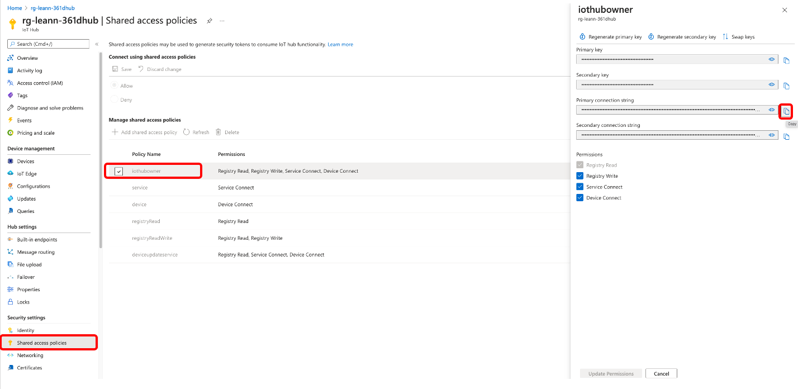

# voice-control-inventory-management
Voice control the Power BI Dashbaord to do the inventory management using the Percept DK audio, Custom Commands, Azure Function, and Power BI.

The goal of this project is to be able to do the inventory management by voice with the Percept DK device and Audio SoM using Azure Custom Commands as the platform.  

## Prerequisites
- Percept DK ([Purchase](https://www.microsoft.com/en-us/store/build/azure-percept/8v2qxmzbz9vc))
- Azure Subscription : [Free trial account](https://azure.microsoft.com/en-us/free/)
- Azure Percept Audio 
- Speaker or headphones that can connect to 3.5mm audio jack (optional) 
- Download and install [Power BI Desktop](https://powerbi.microsoft.com/en-us/downloads/)
- Download and install [VS code](https://code.visualstudio.com/download) 
- Install the IoT Hub and IoT Tools Extension in VS Code 

## Solution Architecture

## Device Setup
1. Follow [Quickstart: unbox and assemble your Azure Percept DK components](https://docs.microsoft.com/en-us/azure/azure-percept/quickstart-percept-dk-unboxing) and the next steps.

## Content
| File             | Description                                                   |
|-------------------------|---------------------------------------------------------------|
| `readme.md`             | This readme file                                              |
| `deployment.template.json`    | The delopyment the edge modules of this Smart Plug Solution |
| `envtemplate`    | The list of the enviroment varialbes for .env use |

## Steps

1. Config an Azure SQL Server Database transaction database
2. Visit the [azure-functions folder](https://github.com/leannhuang/voice-control-inventory-management/tree/main/azure-functions) to config Azure function
3. Visit the [custom commands folder](https://github.com/leannhuang/smart-plug-with-custom-commands/tree/main/custom-commands) to complete setting up the custom commands of the smart stock (Note down the `Application ID`, `Speech resource key`, and `region`)
4. Create a file named `.env` in this folder based on `envtemplate`. Provide values for all variables.
5. Deploy edge modules on your edge device

### Get your IoT Hub connection string
1. Go to IoT Hub service in Azure Portal. Click Shared access policies -> Iothubowner  
2. Click Copy the get the primary connection string 
