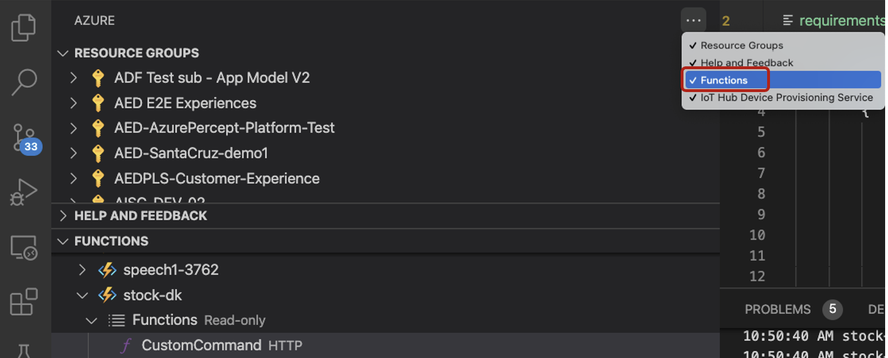
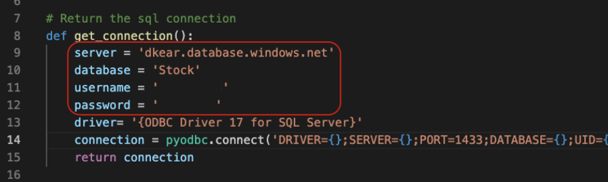
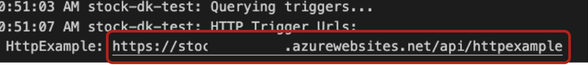

# Deploy your Azure function as web service
Use this folder to deploy azure function as web service

## Prerequsite
1. An Azure account with an active subscription. [Create an account for free](https://azure.microsoft.com/en-us/free/?ref=microsoft.com&utm_source=microsoft.com&utm_medium=docs&utm_campaign=visualstudio). 
2. The [Azure Functions Core Tools](https://docs.microsoft.com/en-us/azure/azure-functions/functions-run-local?tabs=v4%2Cmacos%2Ccsharp%2Cportal%2Cbash%2Ckeda#install-the-azure-functions-core-tools) version 3.x. 
3. [Python versions that are supported by Azure Functions](https://docs.microsoft.com/en-us/azure/azure-functions/supported-languages#languages-by-runtime-version). 
4. [Visual Studio Code](https://docs.microsoft.com/en-us/azure/azure-functions/supported-languages#languages-by-runtime-version) on one of the [supported platforms](https://code.visualstudio.com/docs/supporting/requirements#_platforms). 
5. The [Python extension](https://marketplace.visualstudio.com/items?itemName=ms-python.python) for Visual Studio Code. 
6. The [Azure Functions extension](https://marketplace.visualstudio.com/items?itemName=ms-azuretools.vscode-azurefunctions) for Visual Studio Code. 
7. Click "..." and check the “Functions” has been checked 
   
   
   

## Content
| File             | Description                                                   |
|-------------------------|---------------------------------------------------------------|
| `readme.md`             | This readme file                                              |
| `__init__.py`    | The runtime expects the method to be implemented as a global method called main() in the __init__.py file |
| `CRUD.py`    | The method to create/read/update/delete the records in SQL server database |
| `requirements.txt`    | List of all dependent Python libraries |

## Steps
1. [Create your local project](https://docs.microsoft.com/en-us/azure/azure-functions/create-first-function-vs-code-python#create-an-azure-functions-project)
2. [Run the function locally](https://docs.microsoft.com/en-us/azure/azure-functions/create-first-function-vs-code-python#run-the-function-locally)
3. [Sign in to Azure](https://docs.microsoft.com/en-us/azure/azure-functions/create-first-function-vs-code-python#sign-in-to-azure)
4. [Publish the project to Azure](https://docs.microsoft.com/en-us/azure/azure-functions/create-first-function-vs-code-python#publish-the-project-to-azure)
5. [Run the function in Azure](https://docs.microsoft.com/en-us/azure/azure-functions/create-first-function-vs-code-python#run-the-function-in-azure)
6. Develop CRUD.py to update Azure SQL on Azure Function
   1. Replace the content of __init__.py by using the __init__.py in this folder
   2. Drag and drop the CURD.py to the same layer of __init__.py
   3. Update the sql server, database, username, password in CRUD.py

      

   4. Update your requirements.txt
7. Publishing to an existing function app overwrites the content of that app in Azure. 
     1.   Select the Azure icon in the Activity bar. In the Azure: Functions area, select the Deploy to function app... button.
     2.   Note down the URL for further use

          

     3.   Test post function of the published web service
            ```
            { "color": "yellow", "num_box" :"2", "action":"remove" } 
            ``` 
     4.   Check if the records in your database has been updated 


## Credits and references
- [Create a function in Azure with Python using Visual Studio Code](https://docs.microsoft.com/en-us/azure/azure-functions/create-first-function-vs-code-python#publish-the-project-to-azure) 

